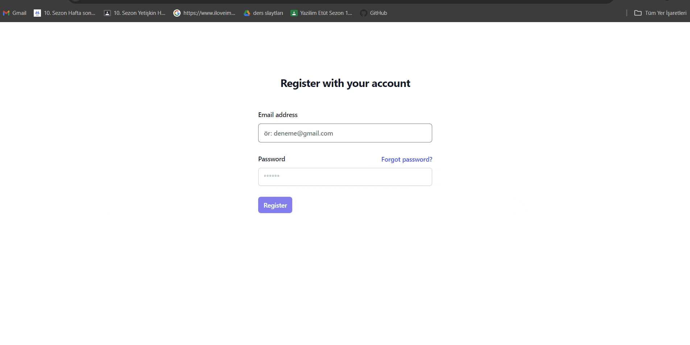

# Firebase Authentication and To-Do Application

This project is a simple yet powerful To-Do application built using Firebase for authentication and real-time database functionalities. The app allows users to sign up, log in, and manage their tasks efficiently.

## Features

User Authentication: Secure sign-up and login using Firebase Authentication.
Real-Time Database: Store and retrieve tasks in real-time with Firebase Firestore.
Task Management: Add, edit, delete, and mark tasks as completed.
Responsive Design: Optimized for both desktop and mobile devices.

## Project gif

